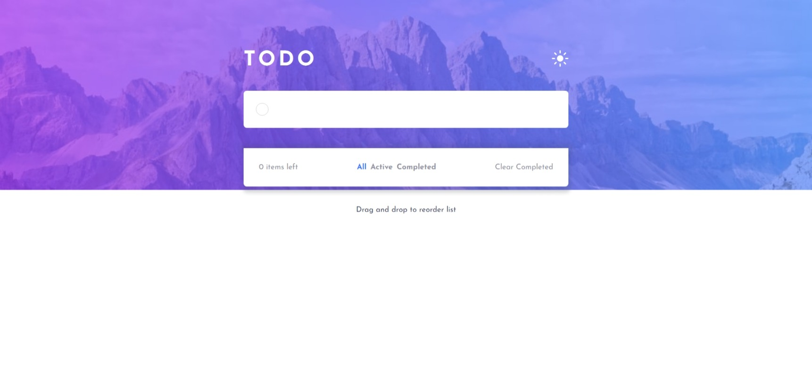
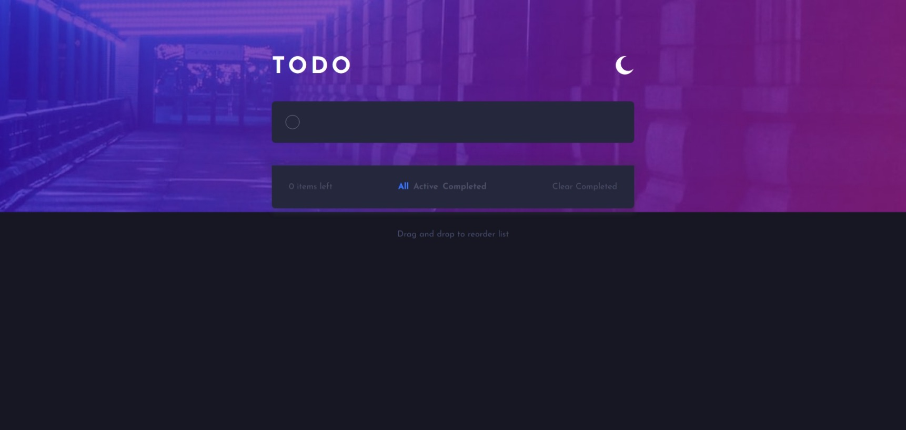

# Frontend Mentor - Todo app solution

This is a solution to the [Todo app challenge on Frontend Mentor](https://www.frontendmentor.io/challenges/todo-app-Su1_KokOW). Frontend Mentor challenges help you improve your coding skills by building realistic projects. 

## Table of contents

- [Overview](#overview)
  - [The challenge](#the-challenge)
  - [Screenshot](#screenshot)
  - [Links](#links)
- [My process](#my-process)
  - [Built with](#built-with)
  - [What I learned](#what-i-learned)
  - [Continued development](#continued-development)
- [Author](#author)

## Overview

### The challenge

Users should be able to:

- View the optimal layout for the app depending on their device's screen size
- See hover states for all interactive elements on the page
- Add new todos to the list
- Mark todos as complete
- Delete todos from the list
- Filter by all/active/complete todos
- Clear all completed todos
- Toggle light and dark mode
- **Bonus**: Drag and drop to reorder items on the list

### Screenshot
Light Mode

Dark Mode

### Links

- Solution URL: [My Solution](https://your-solution-url.com)
- Live Site URL: [Live Site](https://your-live-site-url.com)

## My process

### Built with

- Semantic HTML5 markup
- CSS custom properties
- Flexbox
- [React](https://reactjs.org/) - JS library
- [Styled Components](https://styled-components.com/)
- [React-beautiful-dnd](https://github.com/atlassian/react-beautiful-dnd)

### What I learned

- How to manage states in react.
- How to use those states to display different data.
- How to store states in local storage.
- Using third party react libraries. 

### Continued development

As there are no animations in this project, so in the future I would like to learn about animations and add them to my future projects. 

## Author

- Frontend Mentor - [@Azi-01](https://www.frontendmentor.io/profile/Azi-01)
- Instagram - [@Azi00.00](https://www.instagram.com/azi00.00)

